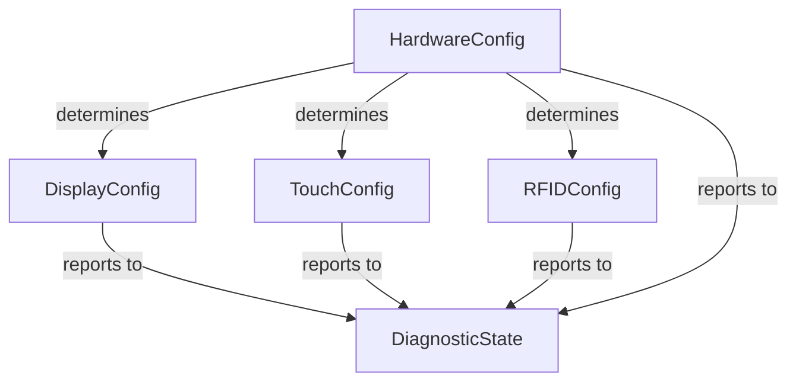

# Data Model: CYD Multi-Model Compatibility

**Feature**: CYD Hardware Abstraction Layer  
**Date**: 2025-09-18  
**Status**: Complete

## Entity Definitions

### 1. HardwareConfig
**Purpose**: Represents detected CYD hardware variant and capabilities

```cpp
struct HardwareConfig {
  // Model identification
  enum ModelType {
    MODEL_UNKNOWN = 0,
    MODEL_CYD_SINGLE_USB = 1,  // ILI9341, micro USB only
    MODEL_CYD_DUAL_USB = 2      // ST7789, micro + Type-C
  };
  ModelType model;
  
  // Display configuration
  uint16_t displayDriverID;      // 0x9341 or 0x8552
  uint8_t backlightPin;          // GPIO21 or GPIO27
  bool backlightActiveHigh;      // true for most CYDs
  
  // Feature flags
  bool hasSDCard;
  bool hasRFID;
  bool hasTouch;
  bool hasAudio;
  
  // Version info
  uint8_t hardwareRevision;      // For future variants
  uint32_t detectedAt;           // Timestamp of detection
};
```

**Validation Rules**:
- model must be valid enum value
- displayDriverID must match known drivers
- backlightPin must be 21 or 27
- At least one feature flag must be true

**State Transitions**:
- UNKNOWN → SINGLE_USB or DUAL_USB (on detection)
- No reverse transitions allowed

### 2. DisplayConfig
**Purpose**: Display driver settings and state

```cpp
struct DisplayConfig {
  // Driver settings
  enum DriverType {
    DRIVER_ILI9341,
    DRIVER_ST7789,
    DRIVER_UNKNOWN
  };
  DriverType driver;
  
  // Display parameters
  uint16_t width;                // 240 or 320 depending on rotation
  uint16_t height;               // 320 or 240 depending on rotation
  uint8_t rotation;              // 0-3 for orientation
  bool colorInverted;            // Some ST7789 need inversion
  bool useBGR;                   // Color order (RGB vs BGR)
  
  // SPI configuration
  uint32_t spiFrequency;         // Display SPI speed
  uint8_t spiMode;               // SPI mode (usually 0)
  
  // Status
  bool initialized;
  uint32_t lastError;
  uint32_t framesRendered;
};
```

**Validation Rules**:
- width * height must equal 76800 (240*320)
- rotation must be 0-3
- spiFrequency must be between 10MHz and 80MHz
- Must be initialized before use

### 3. TouchConfig
**Purpose**: Touch controller calibration and state

```cpp
struct TouchConfig {
  // Calibration data
  struct CalibrationData {
    uint16_t xMin, xMax;         // Raw X range
    uint16_t yMin, yMax;         // Raw Y range
    bool swapXY;                 // Swap X/Y axes
    bool invertX, invertY;       // Invert axes
    uint8_t rotation;            // Match display rotation
  };
  CalibrationData calibration;
  
  // Touch pins (software SPI)
  struct TouchPins {
    uint8_t cs;                  // Chip select (GPIO33)
    uint8_t irq;                 // Interrupt (GPIO36)
    uint8_t mosi;                // Data out (GPIO32)
    uint8_t miso;                // Data in (GPIO39)
    uint8_t clk;                 // Clock (GPIO25)
  };
  TouchPins pins;
  
  // Runtime state
  bool touched;
  uint16_t lastX, lastY;
  uint16_t lastZ;                // Pressure
  uint32_t lastTouchTime;
  
  // Configuration
  uint16_t minPressure;          // Minimum Z for valid touch
  uint16_t debounceMs;           // Debounce time
};
```

**Validation Rules**:
- Calibration ranges must be positive
- Pin numbers must be valid GPIO
- minPressure typically 200-500
- debounceMs typically 20-100

### 4. RFIDConfig
**Purpose**: RFID reader configuration and state

```cpp
struct RFIDConfig {
  // Software SPI pins
  struct RFIDPins {
    uint8_t sck;                 // Clock (GPIO22)
    uint8_t mosi;                // Data out (GPIO27)
    uint8_t miso;                // Data in (GPIO35)
    uint8_t ss;                  // Slave select (GPIO3/RX)
  };
  RFIDPins pins;
  
  // Timing parameters
  struct SPITiming {
    uint8_t clockDelayUs;        // Microseconds between clock edges
    uint8_t operationDelayUs;    // Delay after operations
    uint16_t timeoutMs;          // Operation timeout
    uint8_t maxRetries;          // Retry count for failed ops
  };
  SPITiming timing;
  
  // Runtime state
  bool cardPresent;
  uint8_t lastUID[10];           // Last card UID
  uint8_t uidLength;             // UID length (4, 7, or 10)
  uint32_t lastReadTime;
  
  // Statistics
  uint32_t successfulReads;
  uint32_t failedReads;
  uint32_t timeouts;
  uint32_t collisions;
};
```

**Validation Rules**:
- Pin numbers must match constitution requirements
- clockDelayUs typically 2-10
- timeoutMs typically 50-200
- maxRetries typically 3-5

### 5. DiagnosticState
**Purpose**: System diagnostic information and error tracking

```cpp
struct DiagnosticState {
  // Component status
  enum ComponentStatus {
    STATUS_UNKNOWN = 0,
    STATUS_OK = 1,
    STATUS_WARNING = 2,
    STATUS_ERROR = 3,
    STATUS_FAILED = 4
  };
  
  struct ComponentHealth {
    ComponentStatus display;
    ComponentStatus touch;
    ComponentStatus rfid;
    ComponentStatus sdcard;
    ComponentStatus audio;
    uint32_t lastChecked;
  };
  ComponentHealth health;
  
  // Error tracking
  struct ErrorInfo {
    uint32_t code;               // Error code
    char component[16];          // Component name
    char message[64];            // Error message
    uint32_t timestamp;          // When it occurred
  };
  ErrorInfo lastErrors[10];      // Circular buffer
  uint8_t errorIndex;
  
  // Performance metrics
  struct Performance {
    uint32_t bootTimeMs;         // Time to initialize
    uint32_t freeHeap;           // Available memory
    uint32_t largestFreeBlock;   // Largest contiguous block
    float cpuUsagePercent;       // CPU utilization
    uint16_t loopTimeMs;         // Main loop duration
  };
  Performance metrics;
  
  // Debug settings
  enum DebugLevel {
    DEBUG_NONE = 0,
    DEBUG_ERROR = 1,
    DEBUG_WARNING = 2,
    DEBUG_INFO = 3,
    DEBUG_VERBOSE = 4
  };
  DebugLevel debugLevel;
};
```

**Validation Rules**:
- Component names must be null-terminated
- Error messages must be null-terminated
- Circular buffer index must wrap at 10
- Debug level must be valid enum value

## Relationships



## Persistence Strategy

### EEPROM Layout
```
Address | Size | Content
--------|------|--------
0x00    | 4    | Magic number (0xCYD1)
0x04    | 2    | Structure version
0x06    | 32   | HardwareConfig
0x26    | 64   | TouchConfig calibration
0x66    | 16   | RFIDConfig timing
0x76    | 2    | Checksum
```

### Default Values

```cpp
const HardwareConfig DEFAULT_SINGLE_USB = {
  .model = MODEL_CYD_SINGLE_USB,
  .displayDriverID = 0x9341,
  .backlightPin = 21,
  .backlightActiveHigh = true,
  .hasSDCard = true,
  .hasRFID = true,
  .hasTouch = true,
  .hasAudio = true
};

const HardwareConfig DEFAULT_DUAL_USB = {
  .model = MODEL_CYD_DUAL_USB,
  .displayDriverID = 0x8552,
  .backlightPin = 27,  // or 21 for some units
  .backlightActiveHigh = true,
  .hasSDCard = true,
  .hasRFID = true,
  .hasTouch = true,
  .hasAudio = true
};
```

## Access Patterns

1. **Boot Sequence**:
   - Load HardwareConfig from detection
   - Initialize DisplayConfig based on hardware
   - Load TouchConfig calibration from EEPROM
   - Configure RFIDConfig with timing
   - Initialize DiagnosticState

2. **Runtime Updates**:
   - TouchConfig: Update on each touch event
   - RFIDConfig: Update on card read attempts
   - DiagnosticState: Continuous monitoring
   - DisplayConfig: Rarely changes after init

3. **Error Handling**:
   - All errors logged to DiagnosticState
   - Component status updated on failures
   - Recovery attempted based on error type

## Memory Footprint

- HardwareConfig: 32 bytes
- DisplayConfig: 48 bytes  
- TouchConfig: 64 bytes
- RFIDConfig: 56 bytes
- DiagnosticState: 256 bytes
- **Total**: ~456 bytes static + dynamic allocations

## Thread Safety

All structures are designed for single-threaded access from main loop. If using FreeRTOS tasks:
- Protect with mutexes
- Use atomic operations for status flags
- Copy data for inter-task communication